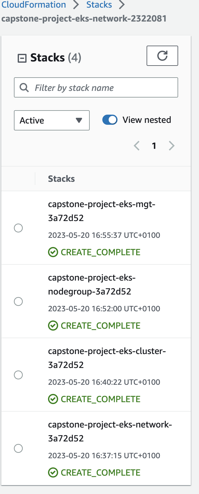
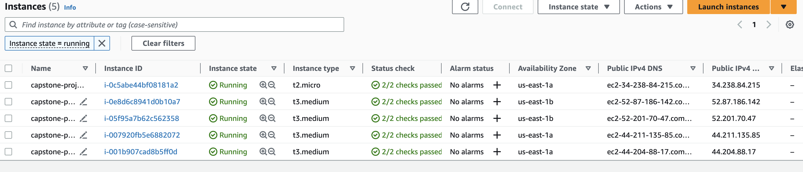
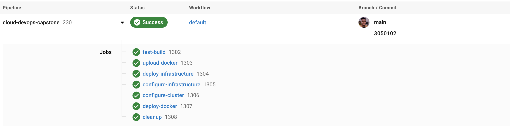
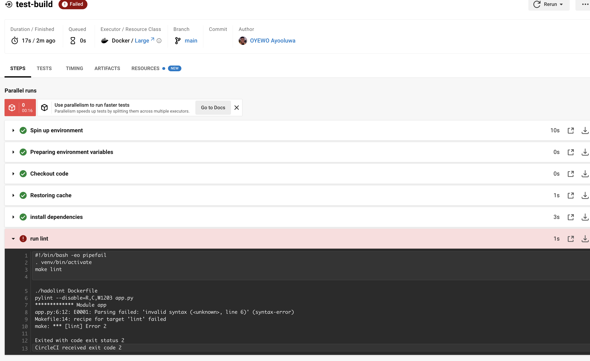
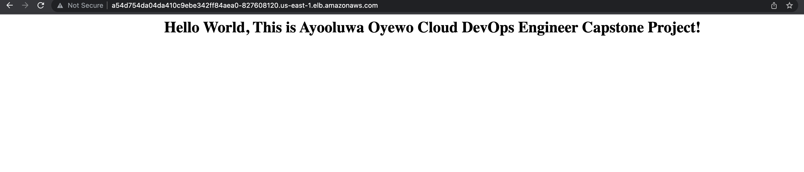

# Cloud DevOps Engineer Capstone Project

This project signifies the successful culmination of the Cloud DevOps Engineer Nanodegree at Udacity through the final Capstone project.

## Key Learnings

Throughout the Cloud DevOps Nanodegree program, I acquired and applied various skills and knowledge, including:

- Implementing Continuous Integration and Continuous Deployment (CI/CD) using CircleCI
- Building and managing pipelines
- Deploying clusters using Ansible and CloudFormation
- Creating Kubernetes clusters
- Building Docker containers within pipelines
- Working with AWS cloud services

## Application Overview

The application is a python3 script that utilizes the <a target="_blank" href="https://flask.palletsprojects.com">Flask framework</a> to render a simple webpage in the user's browser. It includes a requirements.txt file to ensure all necessary dependencies are included.

## Kubernetes Cluster Deployment

To deploy the Kubernetes cluster, I leveraged AWS CloudFormation. The CloudFormation deployment process can be divided into four parts:
- **Networking**, Establishing communication channels for new nodes within the cluster.
- **Elastic Kubernetes Service (EKS)** Creating the Kubernetes cluster itself.
- **NodeGroup**, Defining rules for the creation and operation of instances within the EKS cluster.
- **Management** Configuring and managing the cluster and its deployments and services.

#### Deployed Stacks:


#### Deployed Instances:


## CircleCi - CI/CD Pipelines

To enable Continuous Integration and Continuous Deployment (CI/CD), I utilized CircleCI to create a pipeline that facilitates manual testing and deployment before automatically deploying changes to the cluster using Ansible.

#### From Zero to Hero demonstration:



## Code Linting with Pylint and Hadolint

Code linting is employed to verify the syntactical correctness of the application and Dockerfile, ensuring consistent code quality.

#### Output when the linting step fails:




#### Output when the linting step passes:


## Access the Application

Once the EKS cluster is successfully configured using Ansible within the CI/CD pipeline, the deployment and service can be verified using the following commands:

```
$ kubectl get deployments
NAME                          READY   UP-TO-DATE   AVAILABLE   AGE
capstone-project-deployment   4/4     4            4          3m53s

$ kubectl get services
NAME                       TYPE           CLUSTER-IP       EXTERNAL-IP                                                                  PORT(S)        AGE
capstone-project-service   LoadBalancer   10.100.95.227    a54d754da04da410c9ebe342ff84aea0-827608120.us-east-1.elb.amazonaws.com   80:31092/TCP  3m57s
kubernetes                 ClusterIP      10.100.0.1       <none>                                                                       443/TCP        15m
```

Access the application through the public load balancer DNS: http://a54d754da04da410c9ebe342ff84aea0-827608120.us-east-1.elb.amazonaws.com/


